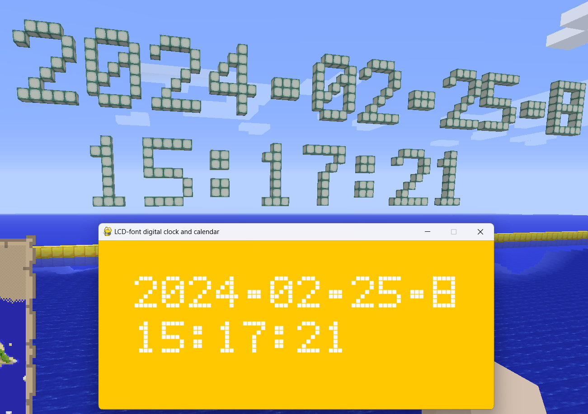
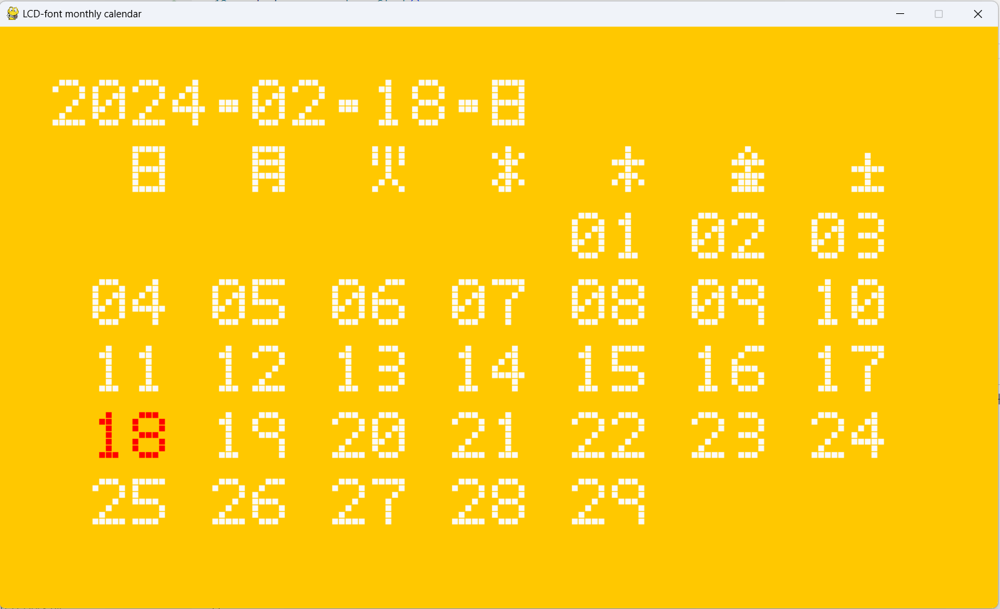
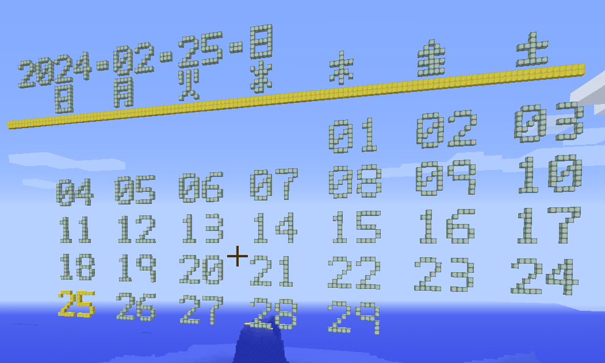
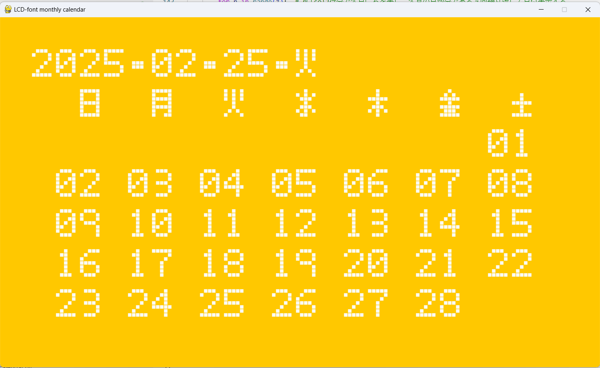
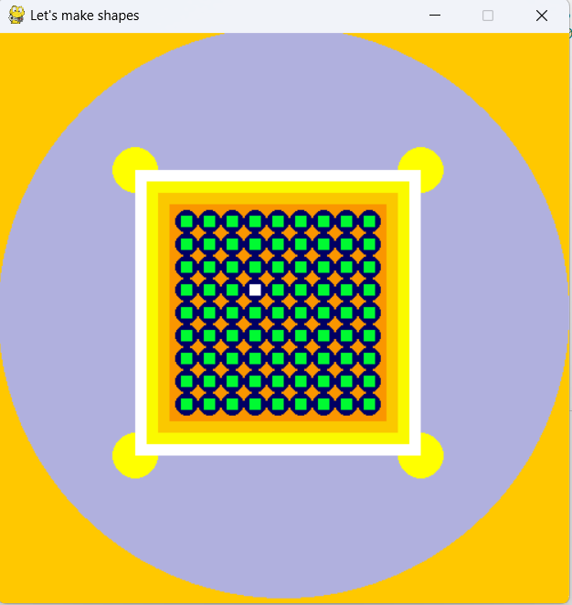

# 元のプログラムからの変更状況
## 1.demo_01.py
### 1. ウィンドウの名前の変更
      pygame.display.set_caption("All This World Is Made of Black And White")
### 2.ウィンドウやオブジェクトの色、オブジェクトのサイズの変更
#### 1.変数の設定
        c1, c2, c3, c4, c5 = 255, 204, 153, 102, 51
        s1, s2, s3 = 150, 125, 50
        r1, r2 = 0, 0
#### 2.スクリーンの表示
        screen.fill((c1, c1, c1))
#### 3.オブジェクトの表示
        if s3>s2:
          pygame.draw.circle(screen, (c2, c2, c2), (320, 240), s1)
          pygame.draw.circle(screen, (c4, c4, c4), (120, 120), s3)
          pygame.draw.circle(screen, (c3, c3, c3), (120, 120), s2)
          pygame.draw.rect(screen, (c5, c5, c5), Rect(120, 120, x2, y2))
        if s2>s3:
          pygame.draw.circle(screen, (c2, c2, c2), (320, 240), s1)
          pygame.draw.circle(screen, (c3, c3, c3), (120, 120), s2)
          pygame.draw.circle(screen, (c4, c4, c4), (120, 120), s3)
          pygame.draw.rect(screen, (c5, c5, c5), Rect(120, 120, x2, y2))
### 3.カラーオン、カラーオフの色の変更
#### 1.変数の設定
        r1, r2 = 0, 0
        g1, g2 = 0, 255
        b1, b2 = 255, 0
#### 2.オブジェクトの表示
        for x0 in range(5):
          for y0 in range(7):
            pygame.draw.rect(screen, color_off, Rect(24 + x0 * 16, 24 + y0 * 16, 12, 12))
        pygame.draw.rect(screen, color_on, Rect(24 + x1 * 16, 24 + y1 * 16, 12, 12))
### 4.動きの追加
#### 1.色の変化の追加
        c1 -= 2
      if c1 < 205:
        c1 = 255
      c2 -= 4
      if c2 < 154:
        c2 = 204
      c3 -= 1
      if c3 < 103:
        c3 = 153
      c4 -= 5
      if c4 < 52:
        c4 = 102
      c5 -= 3
      if c5 < 1:
        c5 = 51
      r1 += 2
      if r1 > 255:
        r1 = 0
      r2 += 2
      if r2 > 255:
        r2 = 0
      g1 += 3
      if g1 >255:
        g1 = 0
      g2 += 1
      if g2 >255:
        g2 = 128
      b1 += 1
      if b1 >255:
        b1 = 128
      b2 += 3
      if b2 >255:
        b2 = 0
#### 2.大きさの変化の追加
        s1 += 2
        if s1 > 225:
          s1 = 150
        s2 += 1
        if s2 > 125:
          s2 = 50
        s3 += 3
        if s3 > 125:
          s3 = 50
        x2 +=5
        if x2 > 320:
          x2 = 100
        y2 += 5
        if y2 > 240:
          y2 = 20
#### 3.運動の様子の追加
        x1 += 1
        if x1 > 4:
          x1 = 0
          y1 += 1
          if y1 > 6:
            y1 = 0
#### 4.オブジェクトの表示
        if s3>s2:
          pygame.draw.circle(screen, (c2, c2, c2), (320, 240), s1)
          pygame.draw.circle(screen, (c4, c4, c4), (120, 120), s3)
          pygame.draw.circle(screen, (c3, c3, c3), (120, 120), s2)
          pygame.draw.rect(screen, (c5, c5, c5), Rect(120, 120, x2, y2))
        if s2>s3:
          pygame.draw.circle(screen, (c2, c2, c2), (320, 240), s1)
          pygame.draw.circle(screen, (c3, c3, c3), (120, 120), s2)
          pygame.draw.circle(screen, (c4, c4, c4), (120, 120), s3)
          pygame.draw.rect(screen, (c5, c5, c5), Rect(120, 120, x2, y2))
        for x0 in range(5):
          for y0 in range(7):
            pygame.draw.rect(screen, color_off, Rect(24 + x0 * 16, 24 + y0 * 16, 12, 12))
        pygame.draw.rect(screen, color_on, Rect(24 + x1 * 16, 24 + y1 * 16, 12, 12))
## 2.demo_LCD_font.py
### 1.フォントの追加
      LCD_4 = (0, 0, 0, 1, 0,
         0, 0, 1, 1, 0,
         0, 1, 0, 1, 0,
         1, 0, 0, 1, 0,
         1, 1, 1, 1, 1,
         0, 0, 0, 1, 0,
         0, 0, 0, 1, 0)

       LCD_5 = (1, 1, 1, 1, 0,
         1, 0, 0, 0, 0,
         1, 0, 0, 0, 0,
         1, 1, 1, 1, 0,
         0, 0, 0, 0, 1,
         0, 0, 0, 0, 1,
         1, 1, 1, 1, 0)

        LCD_6 = (0, 1, 1, 0, 0,
         1, 0, 0, 0, 0,
         1, 0, 0, 0, 0,
         1, 1, 1, 1, 0,
         1, 0, 0, 0, 1,
         1, 0, 0, 0, 1,
         0, 1, 1, 1, 0)

        LCD_7 = (1, 1, 1, 1, 1,
         1, 0, 0, 0, 1,
         0, 0, 0, 0, 1,
         0, 0, 0, 1, 0,
         0, 0, 0, 1, 0,
         0, 0, 1, 0, 0,
         0, 0, 1, 0, 0)

        LCD_8 = (0, 1, 1, 1, 0,
         1, 0, 0, 0, 1,
         1, 0, 0, 0, 1,
         0, 1, 1, 1, 0,
         1, 0, 0, 0, 1,
         1, 0, 0, 0, 1,
         0, 1, 1, 1, 0)

        LCD_9 = (0, 1, 1, 1, 0,
         1, 0, 0, 0, 1,
         1, 0, 0, 0, 1,
         0, 1, 1, 1, 1,
         0, 0, 0, 1, 0,
         0, 0, 0, 1, 0,
         0, 0, 1, 0, 0)
         LCD_font_styles = (LCD_0, LCD_1, LCD_2, LCD_3, LCD_4, LCD_5, LCD_6, LCD_7,LCD_8, LCD_9)
### 2.桁の追加
        def LCD_display(x, y):
          code0 = int((x / 8) % 10)
          code1 = int((((x / 8)-code0) % 100) // 10)
          text1, rect1 = font1.render(str((10*code1)+code0), WHITE)
          rect1.center = (x, y)
          screen.blit(text1, rect1)
          lcd1.update_col(col=0, code=code1)
          lcd1.update_col(col=1, code=code0)
## 3.demo_03
### 1.表示の削除と変更
#### 1.変更前
      display1 = Seven_seg(screen)
      display1.init_col(BLOCK_SIZE=9, BLOCK_INTV=10, COLOR_ON=GREEN, COLOR_OFF=DARK_GRAY)
      display1.init_row(X_ORG=8, Y_ORG=22, COL_INTV=6)

      display2 = Seven_seg(screen)
      display2.init_col(BLOCK_SIZE=7, BLOCK_INTV=8, COLOR_ON=RED, COLOR_OFF=GRAY)
      display2.init_row(X_ORG=2, Y_ORG=18, COL_INTV=6)

      display3 = Seven_seg(screen)
      display3.init_col(BLOCK_SIZE=4, BLOCK_INTV=4)
      display3.init_row(X_ORG=20, Y_ORG=66, COL_INTV=6)

      display4 = Seven_seg(screen)
      display4.init_col(BLOCK_SIZE=4, BLOCK_INTV=4)
      display4.init_row(X_ORG=2, Y_ORG=76, COL_INTV=6)

      display5 = Seven_seg(screen)
      display5.init_col(BLOCK_SIZE=9, BLOCK_INTV=9, COLOR_ON=(120, 200, 250), COLOR_OFF=GRAY)
      display5.init_row(X_ORG=8, Y_ORG=8, COL_INTV=6)
#### 2.変更後
      lcd1 = LCD_font(screen)
      lcd1.__init__(screen)
      lcd1.init_col(BLOCK_SIZE=7, BLOCK_INTV=8, COLOR_ON=GREEN, COLOR_OFF=DARK_GRAY)
      lcd1.init_row(X_ORG=2, Y_ORG=35, COL_INTV=6)

      display1 = LCD_font(screen)
      display1.__init__(screen)
      display1.init_col(BLOCK_SIZE=5, BLOCK_INTV=7, COLOR_ON=RED, COLOR_OFF=GRAY)
      display1.init_row(X_ORG=2, Y_ORG=21, COL_INTV=6)

      display3 = Seven_seg(screen)
      display3.__init__(screen)
      display3.init_col(BLOCK_SIZE=5, BLOCK_INTV=7, COLOR_ON=GREEN, COLOR_OFF=DARK_GRAY)
      display3.init_row(X_ORG=2, Y_ORG=28, COL_INTV=6)

      display2 = LCD_font(screen)
      display2.__init__(screen)
      display2.init_col(BLOCK_SIZE=4, BLOCK_INTV=6, COLOR_ON=RED, COLOR_OFF=GRAY)
      display2.init_row(X_ORG=2, Y_ORG=7, COL_INTV=6)

      display4 = Seven_seg(screen)
      display4.__init__(screen)
      display4.init_col(BLOCK_SIZE=4, BLOCK_INTV=6, COLOR_ON=GREEN, COLOR_OFF=DARK_GRAY)
      display4.init_row(X_ORG=2, Y_ORG=14, COL_INTV=6)
### 2.マイクラ表示の準備
#### 1.変更前
      class LCD_font():
        def __init__(self, screen):
          self.screen = screen

        def init_col(self, BLOCK_SIZE=4,   BLOCK_INTV=4, COLOR_ON=GREEN, COLOR_OFF=GRAY):
          # ひと桁、コラムの設定
          # ブロックのサイズと配置間隔をピクセル指定（インターバル）
          self.BLOCK_SIZE = BLOCK_SIZE
          self.BLOCK_INTV = BLOCK_INTV
          # on/offのカラー
          self.COLOR_ON = COLOR_ON
          self.COLOR_OFF = COLOR_OFF

        def init_row(self, X_ORG=2, Y_ORG=8, COL_INTV=6):  # 表示行の設定
          # xy空間での7セグ表示、最上位桁の左下座標をブロック数で指定
          self.X_ORG = X_ORG * self.BLOCK_INTV
          self.Y_ORG = Y_ORG * self.BLOCK_INTV
          # 各桁のブロック間隔をブロック数で指定（インターバル）
          self.COL_INTV = COL_INTV * self.BLOCK_INTV

        def update_col(self, col=0, code=2):  # ある桁にある文字を表示する関数
          # codeの文字をcol桁目に表示、桁は最上位桁の左から右へ進む。
          block_size = self.BLOCK_SIZE
          i = 0
#### 2.変更後
      class LCD_font():
        def __init__(self, screen):
          self.screen = screen

        def init_col(self, BLOCK_SIZE=4, BLOCK_INTV=4, 　COLOR_ON=WHITE, COLOR_OFF=GRAY):
          # ひと桁、コラムの設定
          # ブロックのサイズと配置間隔をピクセル指定（インターバル）
          self.BLOCK_SIZE = BLOCK_SIZE
          self.BLOCK_INTV = BLOCK_INTV
          # on/offのカラー
          self.COLOR_ON = COLOR_ON
          self.COLOR_OFF = COLOR_OFF

        def init_row(self, X_ORG=2, Y_ORG=8,   COL_INTV=6):  # 表示行の設定
          # xy空間での7セグ表示、最上位桁の左下座標をブロック数で指定
          self.X_ORG = X_ORG * self.BLOCK_INTV
          self.Y_ORG = Y_ORG * self.BLOCK_INTV
          # 各桁のブロック間隔をブロック数で指定（インターバル）
          self.COL_INTV = COL_INTV * self.BLOCK_INTV

        def update_col(self, col=0, code=2, mz=-10, y_change=90):  # ある桁にある文字を表示する関数
          # codeの文字をcol桁目に表示、桁は最上位桁の左から右へ進む。
          block_size = self.BLOCK_SIZE
          i2 = 0
          for y in range(7):
            i1 = 0
            for x in range(5):
                if LCD_font_styles[code * 7 + i2][i1] == 1:
                    color = self.COLOR_ON
                else:
                    color = self.COLOR_OFF
                # 桁の原点
                x0 = self.X_ORG + self.COL_INTV * col
                y0 = self.Y_ORG
                # 桁の原点
                mx0 = 48 - (6 ** col)
                my0 = 0
                mx1 = mx0-i1
                my1 = my0-i2+y_change
                # ドットの原点座標
                org1 = (x0 + i1 * self.BLOCK_INTV, y0 + i2 * self.BLOCK_INTV)
                # ドットを描く
                pygame.draw.rect(self.screen, color, Rect(org1[0], org1[1], block_size, block_size))
                if LCD_font_styles[code * 7 + i2][i1] == 1:
                    mc.setBlock(mx1, my1, mz,  param.IRON_BLOCK)
                else:
                    mc.setBlock(mx1, my1, mz,  param.AIR)
                i1 += 1
            i2 += 1
        def backspace(self, col=0, mz=-10, y_change=90):
          block_size = self.BLOCK_SIZE
          i2 = 0
          for y in range(7):
            i1 = 0
            for x in range(5):
                color = self.COLOR_OFF
                # 桁の原点
                x0 = self.X_ORG + self.COL_INTV * col
                y0 = self.Y_ORG
                # 桁の原点
                mx0 = 48 - (6 ** col)
                my0 = 0
                mx1 = mx0-i1
                my1 = my0-i2+y_change
                # ドットの原点座標
                org1 = (x0 + i1 * self.BLOCK_INTV, y0 + i2 * self.BLOCK_INTV)
                # ドットを描く
                pygame.draw.rect(self.screen, color, Rect(org1[0], org1[1], block_size, block_size))
                mc.setBlock(mx1, my1, mz,  param.AIR)
                i1 += 1
            i2 += 1

# Digital Clock and Monthly Calendar by LCD font numbers [**(日本語版：README_JAPANESE)**](./README_JAPANESE.md)
I made some digital clocks and monthly calendars for pygame and minecraft world.
This is my first step to push on GitHub repository.
Please enjoy especially some codes below.

 - [LCD_font_calender_in_mc_and_pg.py](./LCD_font_calendar_in_mc_and_pg.py) : This is a digital clock and calendar for pygame and minecraft.

  

 - [LCD_font_monthly_calendar.pg.py](./LCD_font_monthly_calendar.pg.py) : This is a monthly calendar with today's date in red for pygame.

  

 - [LCD_font_monthly_calendar.mc.py](./LCD_font_monthly_calendar.mc.py) : This is a monthly calendar for minecraft. Please look around in the sky to find a big calendar!

  

 - [LCD_font_changeable_monthly_calendar_pg.py](./LCD_font_changeable_monthly_calendar_pg.py) : This is a digital monthly calendar for pygame.
    You can change the month by pushing ← or → key and the year by pushing ↑ or ↓.
    It suddenly erases dates of the monthly calendar when it's changed months though I don't know why.
    If somebody finds the bug, please tell me.
    → I fix it completely. Please check the code below.
    [LCD_font_new_changeable_monthly_calendar_pg.py](./LCD_font_new_changeable_monthly_calendar_pg.py)

  

 - [fancy_shapes.py](./fancy_shapes.py) : I built fancy shapes by squares and circles for pygame. Green squares will change color in order.

  

## The original README is below.
# pygame_samples

 - demo_01.py: pygameの超簡単なデモ。
 - demo_02.py: 7セグのシミュレーション、各セグメントを2ブロックで構成。Seven_segクラス使用。
 - demo_LCD_font_01.py: 5x7のLCDフォント制作用。LCD_fontクラス使用。
 - demo_LCD_font.py: 5x7のLCDフォント、完成版。

 - demo_freetype.py: pygame.freetypeでテキスト表示。（新しい方式）
 - demo_freetype.py: pygame.fontでテキスト表示。（古い方式）
 - demo_openmoji.py: オープンソースの絵文字、openmojiのデモ。キー操作のデモ。
 - seven_seg_pg.py: Seven_segクラス
 - lcd_font_pg.py: LCD_fontクラス
